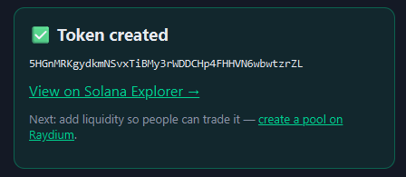

# 🔒 SafeMint — Open-Source Solana Token Creator

Create a Solana token (SPL) in your browser. Connect a wallet, type a name, flip the
safety switches, hit **Create**. **Open source · non-custodial · it never sees your private key.**

<p align="center">
  
</p>

SafeMint is built to be the *opposite* of the wallet-drainer "token launchers" that plague
crypto: no binary to download, no private key to paste. You sign every action in your own
wallet (Phantom/Solflare), and you can read every line of what it does.

**Two ways to use it:**

- **[`web/`](web/) — the web app (start here).** The GUI above. Built for everyone. See
  [web/README.md](web/README.md).
- **CLI (below) — for developers.** A scriptable version of the same
  create → metadata → revoke-authorities flow.

> **Safety promise:** neither tool ever asks for your seed phrase or private key typed into
> a box. If any "launcher" tells you to download an `.exe` and paste a private key, it's a
> wallet drainer — close it.

Every token it creates can revoke mint + freeze authority and lock its metadata — the exact
things scanners like RugCheck and DexScreener check — so your token reads **safe by default**:

<p align="center">
  
</p>

> ✅ Verified working end-to-end on devnet — token minted, supply correct, mint & freeze
> authorities revoked, metadata immutable.

---

## CLI

A small, self-contained CLI that launches a standard **SPL token** on Solana. It:

1. Creates the token mint
2. Attaches on-chain metadata (name, symbol, image)
3. Mints the full supply to your wallet
4. **Revokes the mint authority** — supply can never be inflated
5. **Revokes the freeze authority** — nobody's tokens can ever be frozen

Steps 4 and 5 are what token scanners (RugCheck, DexScreener, etc.) look for to mark a
token "safe." This tool does them automatically.

It defaults to **devnet** (a free test network) so you can rehearse the whole thing for
free. The real launch on mainnet requires an explicit confirmation flag.

> **What this tool does NOT do:** it does not create liquidity and it does not market the
> coin. Liquidity is added separately on Raydium (see step 5 below) — deliberately, so the
> liquidity is created and controlled entirely by you, with your own wallet.

---

## Requirements

- [Node.js](https://nodejs.org) 18 or newer
- A little SOL in a wallet (free on devnet; real SOL on mainnet — roughly **0.02–0.05 SOL**
  covers the mint, metadata, and fees)

## Setup

```bash
npm install
cp config.example.json config.json   # Windows: copy config.example.json config.json
```

Then open `config.json` and fill in your token details (name, symbol, supply, etc.).

---

## Step 1 — Create and fund a wallet

This wallet pays the fees and receives the entire token supply. Create a dedicated one:

```bash
npm run keygen
```

This writes `keypair.json` and prints its **address**. Fund that address with SOL:

- **Devnet (testing):** use the faucet at https://faucet.solana.com (sign in with GitHub),
  or `solana airdrop 2 <ADDRESS> --url devnet` if you have the Solana CLI.
- **Mainnet (real launch):** send real SOL to the address from any exchange or wallet.

Make sure `config.json` → `keypairPath` points at this file.

> The keypair file **is** the wallet. Keep it secret. It is git-ignored by default.

---

## Step 2 — (Optional) Upload the logo + metadata

If you don't already have a hosted metadata JSON, this uploads your logo and a metadata
file to permanent storage (Arweave) and prints a URL to paste into `config.json`:

```bash
npm run upload -- ./logo.png "A short description of the coin"
```

Copy the printed URL into `config.json` → `token.metadataUri`.

(On mainnet this costs a few cents of SOL. On devnet it's free. You can also skip this and
host the JSON yourself — it just needs `{ "name", "symbol", "description", "image" }`.)

---

## Step 3 — Test on devnet (free, do this first)

With `config.json` → `cluster` set to `"devnet"`:

```bash
npm run launch
```

It prints the new mint address and an Explorer link. Open the link and confirm the token,
its metadata, and that mint/freeze authorities show as revoked. Nothing here costs real money.

---

## Step 4 — Launch on mainnet (real)

When you're happy with the devnet result, edit `config.json`:

- set `"cluster": "mainnet-beta"`
- (recommended) set `"rpcUrl"` to a paid RPC endpoint from
  [Helius](https://helius.dev) / [QuickNode](https://quicknode.com) / [Triton](https://triton.one) —
  the free public mainnet RPC is unreliable for this.

Then run, with the explicit confirmation flag:

```bash
npm run launch -- --yes-mainnet
```

This is **irreversible** and spends real SOL. The supply is fixed and authorities revoked
the moment it finishes.

---

## Step 5 — Add liquidity so people can trade it

The token exists, but it can't be bought or sold until there's a liquidity pool. Do this in
Raydium's web UI (no code, ~2 minutes):

1. Go to **https://raydium.io/liquidity/create-pool/** and connect the wallet that holds the supply.
2. Choose **Standard AMM (CPMM)** and paste your **mint address** as the base token; pair it with **SOL** (or USDC).
3. Set how many tokens and how much SOL to seed the pool with — this sets the starting price.
4. Confirm. The pair becomes tradable and shows up on DexScreener / Jupiter shortly after.
5. **(Strongly recommended for trust)** Burn or lock the LP tokens you receive, so holders
   can see the liquidity can't be pulled. Tools like a token incinerator or a lock service
   handle this.

---

## Configuration reference (`config.json`)

| Field             | Meaning |
|-------------------|---------|
| `cluster`         | `"devnet"` (test) or `"mainnet-beta"` (real). |
| `rpcUrl`          | Optional RPC override. Leave `""` to use the public endpoint. Use a paid one for mainnet. |
| `keypairPath`     | Path to the wallet keypair JSON that pays fees and receives the supply. |
| `token.name`      | Full token name, e.g. `"My Meme Coin"`. |
| `token.symbol`    | Ticker, e.g. `"MEME"`. |
| `token.decimals`  | Decimal places. `9` is the Solana convention. |
| `token.supply`    | Total whole tokens to mint (excluding decimals). `1000000000` = 1 billion. |
| `token.metadataUri` | URL to the metadata JSON (from step 2, or self-hosted). |

## Scripts

| Command | What it does |
|---------|--------------|
| `npm run keygen` | Create a new wallet keypair file. |
| `npm run upload -- ./logo.png "desc"` | Upload logo + metadata, print a `metadataUri`. |
| `npm run launch` | Run the launch (devnet, or mainnet with `-- --yes-mainnet`). |
