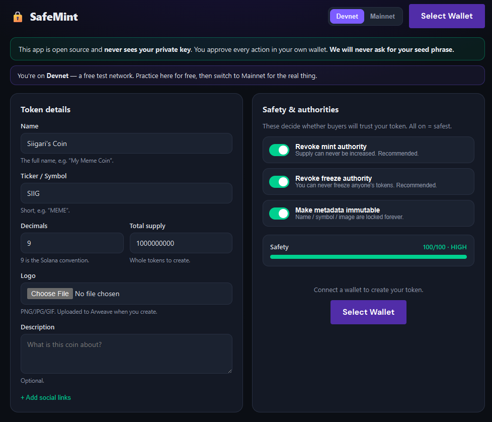

# SafeMint — Open-Source Solana Token Creator (Web)

Create a Solana token (SPL) from your browser. Connect a wallet, fill in a name,
flip the safety switches, hit **Create**.

<p align="center">
  
</p>

## Why this one is safe

The entire crypto-launcher space is full of "token makers" that are actually
wallet drainers. The tell is always the same: *download this `.exe`, paste your
private key.* This app is the opposite, by design:

- **It never sees your private key.** You connect Phantom/Solflare via the
  standard Solana wallet-adapter; the wallet signs every transaction internally.
  The app only ever receives a *signature*, never the secret.
- **No binaries, no backend.** It's a static site built from this source. Read
  the code, or run it yourself. Nothing to download and "trust."
- **It will never ask for your seed phrase.** Nothing legitimate ever does.
- **Test for free first.** Defaults to Devnet so you can rehearse the whole thing
  with fake SOL before spending anything real.

> If any tool ever asks you to type or paste your private key or seed phrase into
> a box, a file, or an `.exe` — it is stealing from you. Close it.

## What it does (v1)

- Create an SPL token: name, symbol, decimals, supply, logo, description, socials
- Upload logo + metadata to Arweave (paid by your wallet; free on devnet)
- One-click safety toggles, all **on** by default:
  - **Revoke mint authority** — supply can never be inflated
  - **Revoke freeze authority** — you can never freeze a holder's tokens
  - **Make metadata immutable** — name/symbol/image locked forever
- A **live safety meter** that warns you, loudly, when a choice would make buyers
  distrust your token
- Devnet ⇄ Mainnet switch

It deliberately does **not** create liquidity — you do that yourself on
[Raydium](https://raydium.io/liquidity/create-pool/) with your own wallet, which
keeps this tool purely a *creator*, never a custodian of funds.

## Run it locally

```bash
npm install
npm run dev      # http://localhost:5173
```

Then: connect a wallet → keep the network on **Devnet** → fill in a name and
ticker → **Create token on Devnet**. You'll approve a few transactions in your
wallet. Open the Explorer link it gives you to see the result.

> Devnet SOL is free from https://faucet.solana.com. For a real launch, switch
> the toggle to **Mainnet** and fund your wallet with real SOL (~0.02–0.05 covers
> creation + metadata upload).

## Build & deploy

```bash
npm run build    # outputs a static site to dist/
```

`dist/` is a plain static bundle — deploy it to Vercel, Netlify, Cloudflare
Pages, or GitHub Pages. No server, no secrets, nothing to host but files.

## How the safety guarantee works (architecture)

```
Your wallet (Phantom)         This app (browser)              Solana
  holds the private key  ──▶  builds an unsigned tx  ──▶  RPC sends it
  signs internally       ◀──  asks wallet to sign
  returns a signature    ──▶  attaches signature      ──▶  on-chain
```

The private key never leaves the wallet extension. `walletAdapterIdentity` (from
`@metaplex-foundation/umi-signer-wallet-adapters`) bridges the connected wallet
to the Metaplex Umi client, so the same create→mint→revoke flow the CLI runs with
a keypair file runs here with wallet-prompted signatures instead.

## Roadmap

- **Tier 2:** Token-2022 extensions (transfer fee, non-transferable, etc.),
  airdrop / multisend, mainnet RPC override, cost preview
- **Tier 3:** in-app Raydium pool creation + LP burn, a token **safety checker**
  (paste any mint → see its authorities and risks)

## A note on responsibility

This is neutral infrastructure: it makes standard, transparent tokens. It does
not, and will not, add fraud-only features (hidden mint backdoors, honeypot
transfer logic). What you launch with it, and how you behave afterward, is on
you. Don't use it to defraud people.
